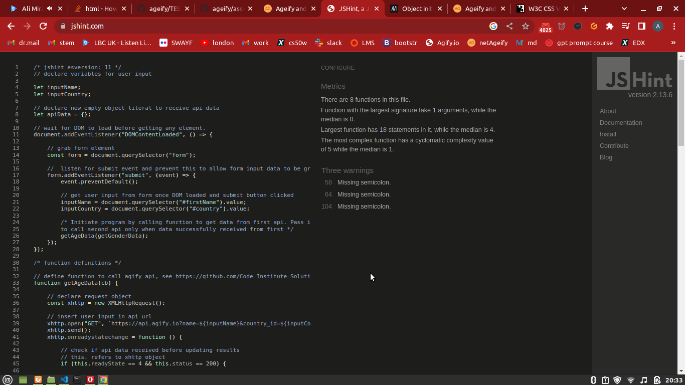
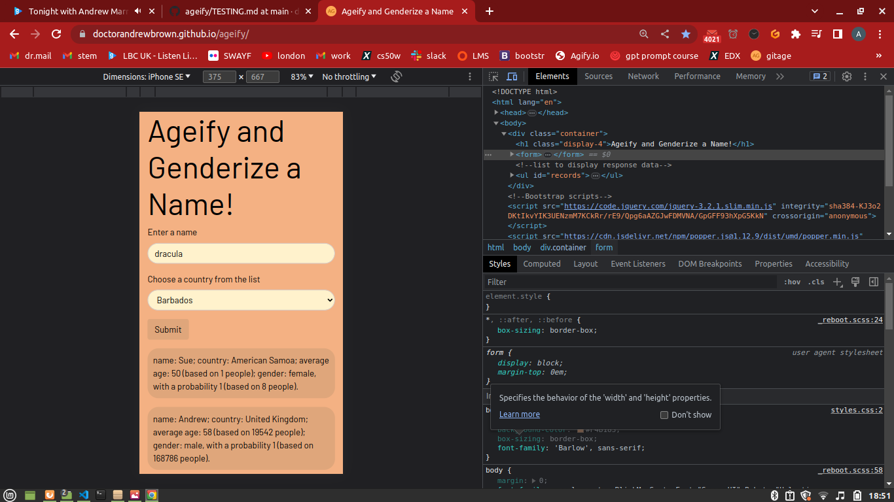
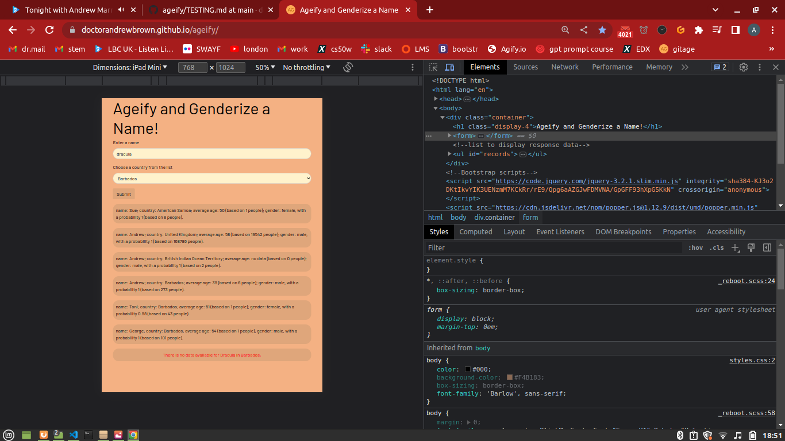
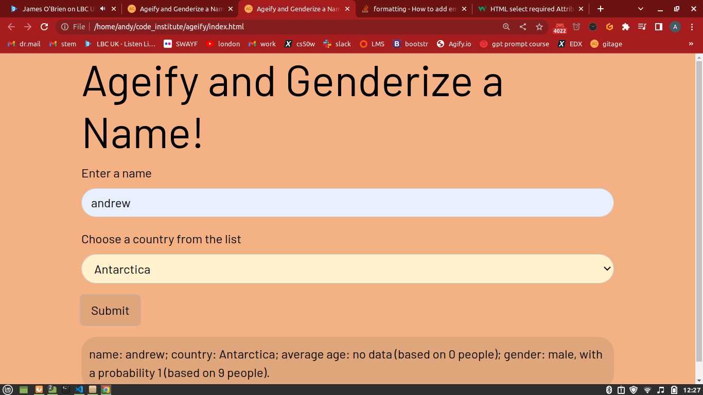
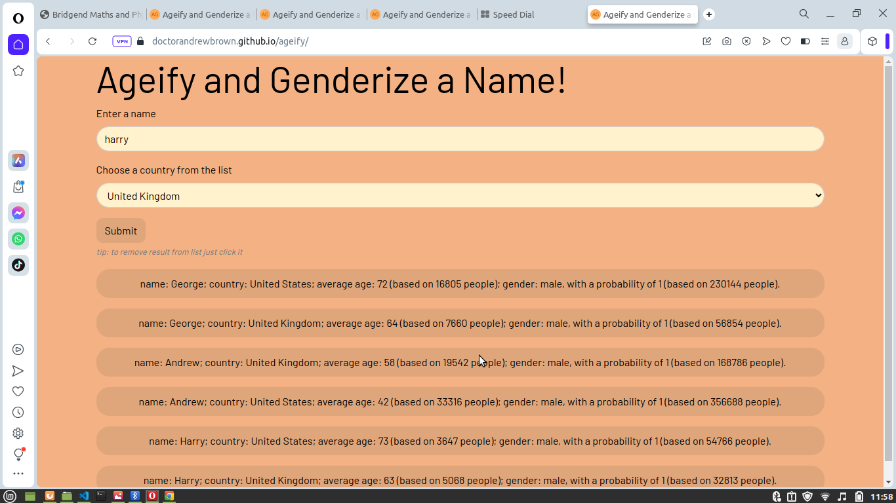
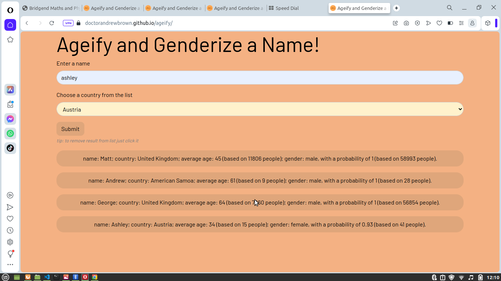
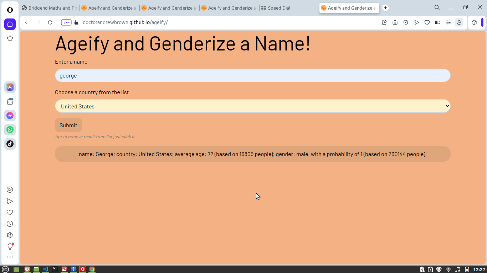

# Testing

Return back to the [README.md](README.md) file.


### HTML

I have used the recommended [HTML W3C Validator](https://validator.w3.org) to validate all of my HTML files.

| Page | W3C URL | Screenshot | |
| --- | --- | --- | --- |
| Home | [W3C](https://validator.w3.org/nu/?doc=https%3A%2F%2Fdoctorandrewbrown.github.io%2Fageify%2F) |  | 
|

### CSS

I have used the recommended [CSS Jigsaw Validator](https://jigsaw.w3.org/css-validator) to validate all of my CSS files.

| File | Jigsaw URL | Screenshot | |
| --- | --- | --- | --- |
| style.css | [Jigsaw](https://jigsaw.w3.org/css-validator/validator?uri=https%3A%2F%2Fdoctorandrewbrown.github.io%2Fageify%2F&profile=css3svg&usermedium=all&warning=1&vextwarning=&lang=en) ||
### JavaScript

I have used the recommended [JShint Validator](https://jshint.com) to validate all of my JS files.


| File | Screenshot | Notes |
| --- | --- | --- |
| scripts.js |  | Missing () from new object constructor and missing semicolons |
 |

## Browser Compatibility


I've tested my deployed project on multiple browsers to check for compatibility issues.

| Browser | Screenshot | Notes |
| --- | --- | --- |
| Chrome |  | Problem with correct rendering of style in laptop view when using github pages hosting in chrome browser|
| Firefox |  | Works as expected |
| Opera |  | Works as expected |

## Responsiveness


I've tested my deployed project on multiple devices to check for responsiveness issues.

| Device | Screenshot | Notes |
| --- | --- | --- |
| Mobile (DevTools) |  | Works as expected |
| Tablet (DevTools) |  | Works as expected |
| Laptop |  | Problem with styling in chrome browser. Works as expected in Opera and Firefox |
| Samsung Galaxy mobile phone (real device) |  | Works as expected |
| Samsung Galaxy mobile phone (real device) |  | Works as expected |
## Lighthouse Audit


I've tested my deployed project using the Lighthouse Audit tool to check for any major issues.

| Page | Size | Screenshot | Notes |
| --- | --- | --- | --- |
| Home | Mobile |  | Some minor warnings |
| Home | Desktop |  | Some minor warnings |
|

## Defensive Programming


Defensive programming was manually tested with the below user acceptance testing:

| Page | User Action | Expected Result | Pass/Fail | Screenshot |Comments|
| --- | --- | --- | --- | --- |---|
| Home Page | | | | |
| | Click submit without filling required "name" form field | Inform user field is required | Pass | |The required country field is protected by being hard-coded select dropdown|
| | Submit non existent name| Show meaningful message where both apis return no data| Pass || App logic ensures meaningful message displayed rather than null values returned from api |
| | Submit name and country for which one api returns data but the other does not | Show partial data that is returned, and meaningful message flaging where no data is returned| Pass ||Example shows Ageify api has returned no data but Genderize api has. No instances of Genderize returning data but Agify not returning were seen in manual testing but logic is included to handle this possibility|
| |Submit name without capitalization | Enforce capitalization of name in results display| Pass ||Example shows user inputs a lowercase name which is capitalized in results by app logic|
|
|
## User Story Testing

⚠️⚠️⚠️⚠️⚠️ START OF NOTES (to be deleted) ⚠️⚠️⚠️⚠️⚠️

Testing user stories is actually quite simple, once you've already got the stories defined on your README.

Most of your project's **features** should already align with the **user stories**,
so this should as simple as creating a table with the user story, matching with the re-used screenshot
from the respective feature.

🛑🛑🛑🛑🛑 END OF NOTES (to be deleted) 🛑🛑🛑🛑🛑

| User Story | Screenshot | Comments |
| --- | --- |----|
| As a new site user, I would like to enter a name and country, so that I can find the average age and probable gender for the name for that country. |  |
| As a new site user, I would like to have results for multiple requests shown as a list, so that I can make comparisons e.g. same name in different countries. |  |
| As a new site user, I would like to have the ability to remove unwanted results from display so that I can keep results uncluttered (for recording in a screen shot for example). The screenshots show the same results list before and after the result for a non-existant name removed|  ||
| As a new user I would like to be able to find what proportion of people in the UK who are named Ashley are males?|  |
| As a new user I would like to find the average age of people in USA who are named George? |  |

## Automated Testing

I have conducted a series of automated tests on my application.

I fully acknowledge and understand that, in a real-world scenario, an extensive set of additional tests would be more comprehensive.

### JavaScript (Jest Testing)

⚠️⚠️⚠️⚠️⚠️ START OF NOTES (to be deleted) ⚠️⚠️⚠️⚠️⚠️

Adjust the code below (file names, etc.) to match your own project files/folders.

🛑🛑🛑🛑🛑 END OF NOTES (to be deleted) 🛑🛑🛑🛑🛑

I have used the [Jest](https://jestjs.io) JavaScript testing framework to test the application functionality.

In order to work with Jest, I first had to initialize NPM.

- `npm init`
- Hit `enter` for all options, except for **test command:**, just type `jest`.

Add Jest to a list called **Dev Dependencies** in a dev environment:

- `npm install --save-dev jest`

**IMPORTANT**: Initial configurations

When creating test files, the name of the file needs to be `file-name.test.js` in order for Jest to properly work.

Due to a change in Jest's default configuration, you'll need to add the following code to the top of the `.test.js` file:

```js
/**
 * @jest-environment jsdom
 */

const { test, expect } = require("@jest/globals");
const { function1, function2, function3, etc. } = require("../script-name");

beforeAll(() => {
    let fs = require("fs");
    let fileContents = fs.readFileSync("index.html", "utf-8");
    document.open();
    document.write(fileContents);
    document.close();
});
```

Remember to adjust the `fs.readFileSync()` to the specific file you'd like you test.
The example above is testing the `index.html` file.

Finally, at the bottom of the script file where your primary scripts are written, include the following at the bottom of the file.
Make sure to include the name of all of your functions that are being tested in the `.test.js` file.

```js
if (typeof module !== "undefined") module.exports = {
    function1, function2, function3, etc.
};
```

Now that these steps have been undertaken, further tests can be written, and be expected to fail initially.
Write JS code that can get the tests to pass as part of the Red-Green refactor process.

Once ready, to run the tests, use this command:

- `npm test`


**NOTE**: To obtain a coverage report, use the following command:

- `npm test --coverage`

Below are the results from the tests that I've written for this application:

| Test Suites | Tests | Coverage | Screenshot |
| --- | --- | --- | --- |
| 1 passed | 16 passed | 55% |  |
| x | x | x | repeat for all remaining tests |

#### Jest Test Issues

⚠️⚠️⚠️⚠️⚠️ START OF NOTES (to be deleted) ⚠️⚠️⚠️⚠️⚠️

Use this section to list any known issues you ran into while writing your Jest tests.
Remember to include screenshots (where possible), and a solution to the issue (if known).

This can be used for both "fixed" and "unresolved" issues.

🛑🛑🛑🛑🛑 END OF NOTES (to be deleted) 🛑🛑🛑🛑🛑

## Bugs

- JS Uncaught  Type Error: `apiData.age_count = ageCount` can not set property value for undefined apiData object

    

    - To fix this, I _declared a new object, 
     ```js
         let apiData = new Object();
    ``` 
    allowing a property `age_count`
    to be set for `apiData` object.

- JS Uncaught  Type Error: `Cannot read properties of null`. This error was caused by javascript attempting to read a value from html input element too soon. 
 
    

    - To fix this, I included the following code to add an event listener for the DOM loaded event, 
     ```js
     document.addEventListener("DOMContentLoaded", ()=>{..})
     ```
  
- Preventing default `submit` event for html `<form>` element: This issue prevented getting form user input before the default behavior.  
   

    - To fix this, I included the following code to prevent default `<form>` submission behavior; 
    ```js
    form.addEventListener("submit", (event)=> {
    event.preventDefault()....
    ```


**Fixed Bugs**

All previously closed/fixed bugs can be tracked [here](https://github.com/doctorandrewbrown/agify/issues?q=is%3Aissue+is%3Aclosed).

| Bug | Status |
| --- | --- |
| [JS Uncaught ReferenceError: `foobar` is undefined/not defined](https://github.com/doctorandrewbrown/agify/issues/1) | Closed |
| [Python `'ModuleNotFoundError'` when trying to import module from imported package](https://github.com/doctorandrewbrown/agify/issues/2) | Closed |
| [Django `TemplateDoesNotExist` at /appname/path appname/template_name.html](https://github.com/doctorandrewbrown/agify/issues/3) | Closed |

**Open Issues**

Any remaining open issues can be tracked [here](https://github.com/doctorandrewbrown/agify/issues).

| Bug | Status |
| --- | --- |
| [JS `'let'` or `'const'` or `'template literal syntax'` or `'arrow function syntax (=>)'` is available in ES6 (use `'esversion: 11'`) or Mozilla JS extensions (use moz).](https://github.com/doctorandrewbrown/agify/issues/4) | Open |
| [Python `E501 line too long` (93 > 79 characters)](https://github.com/doctorandrewbrown/agify/issues/5) | Open |

## Unfixed Bugs

⚠️⚠️⚠️⚠️⚠️ START OF NOTES (to be deleted) ⚠️⚠️⚠️⚠️⚠️

You will need to mention unfixed bugs and why they were not fixed.
This section should include shortcomings of the frameworks or technologies used.
Although time can be a big variable to consider, paucity of time and difficulty understanding
implementation is not a valid reason to leave bugs unfixed.

If you've identified any unfixed bugs, no matter how small, be sure to list them here.
It's better to be honest and list them, because if it's not documented and an assessor finds the issue,
they need to know whether or not you're aware of them as well, and why you've not corrected/fixed them.

Some examples:

🛑🛑🛑🛑🛑 END OF NOTES (to be deleted) 🛑🛑🛑🛑🛑

- On devices smaller than 375px, the page starts to have `overflow-x` scrolling.

    

    - Attempted fix: I tried to add additional media queries to handle this, but things started becoming too small to read.

- For PP3, when using a helper `clear()` function, any text above the height of the terminal does not clear, and remains when you scroll up.

    

    - Attempted fix: I tried to adjust the terminal size, but it only resizes the actual terminal, not the allowable area for text.

- When validating HTML with a semantic `section` element, the validator warns about lacking a header `h2-h6`. This is acceptable.

    

    - Attempted fix: this is a known warning and acceptable, and my section doesn't require a header since it's dynamically added via JS.

⚠️⚠️⚠️⚠️⚠️ START OF NOTES (to be deleted) ⚠️⚠️⚠️⚠️⚠️

If you legitimately cannot find any unfixed bugs or warnings, then use the following sentence:

🛑🛑🛑🛑🛑 END OF NOTES (to be deleted) 🛑🛑🛑🛑🛑

There are no remaining bugs that I am aware of.