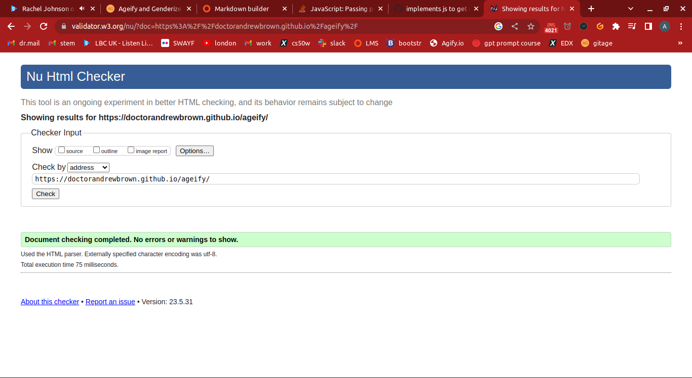
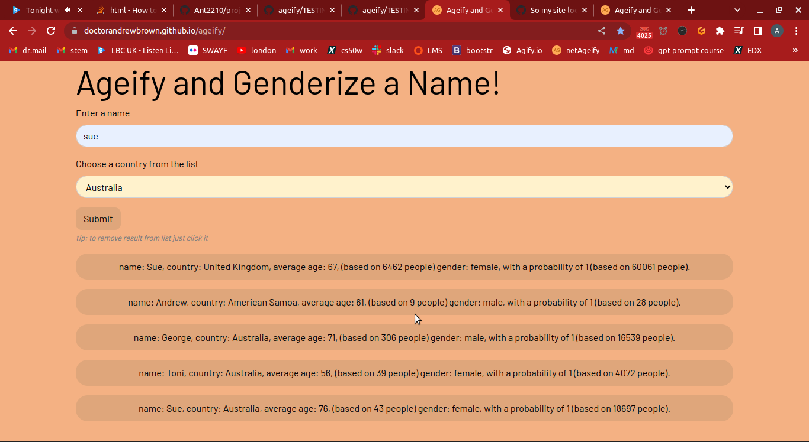
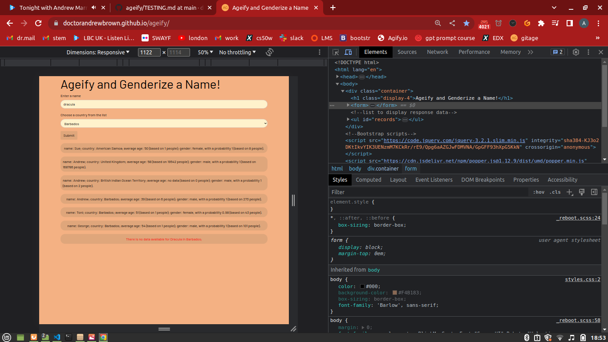
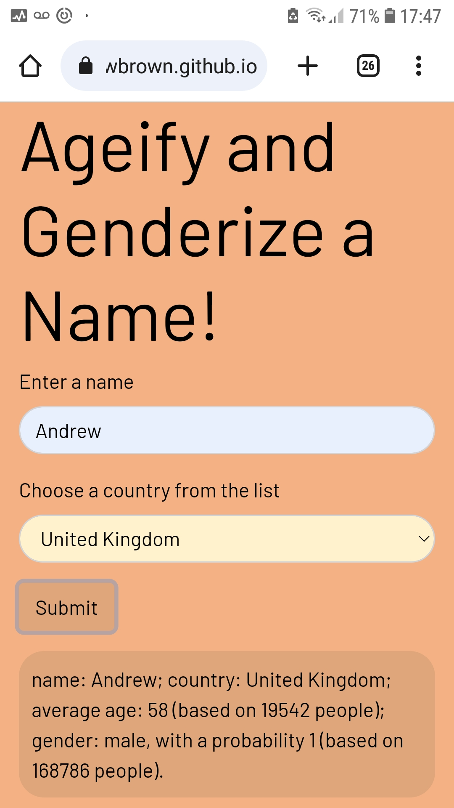
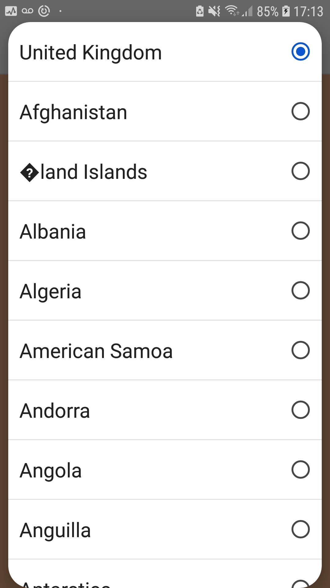
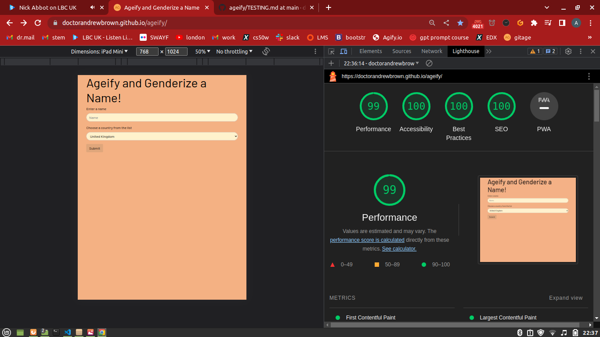
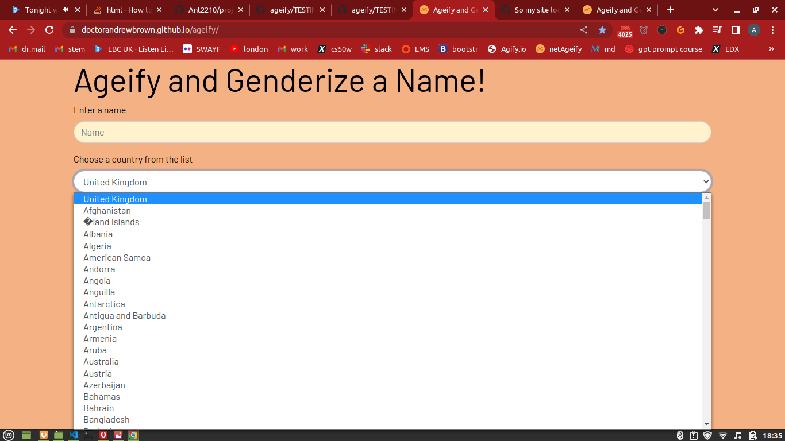
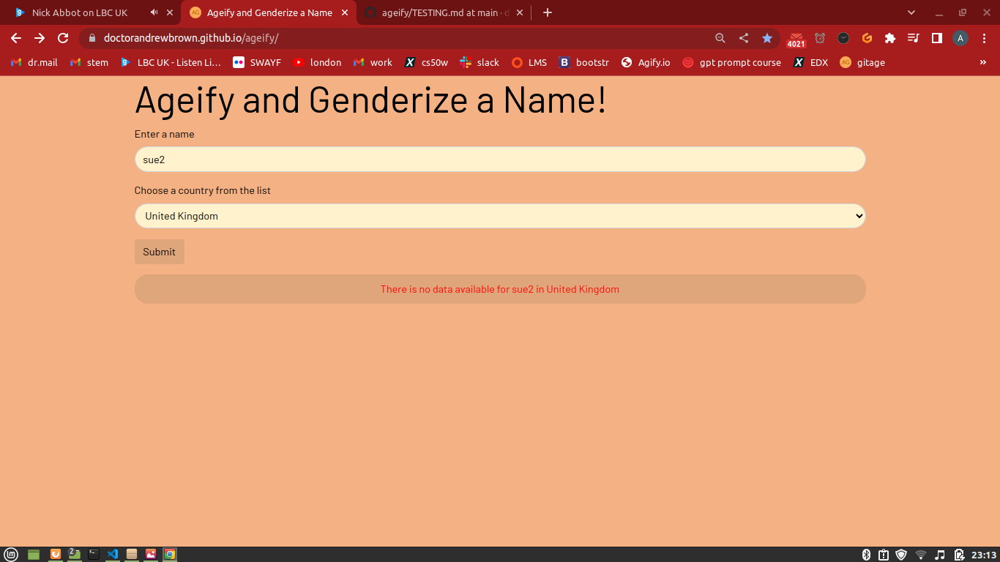
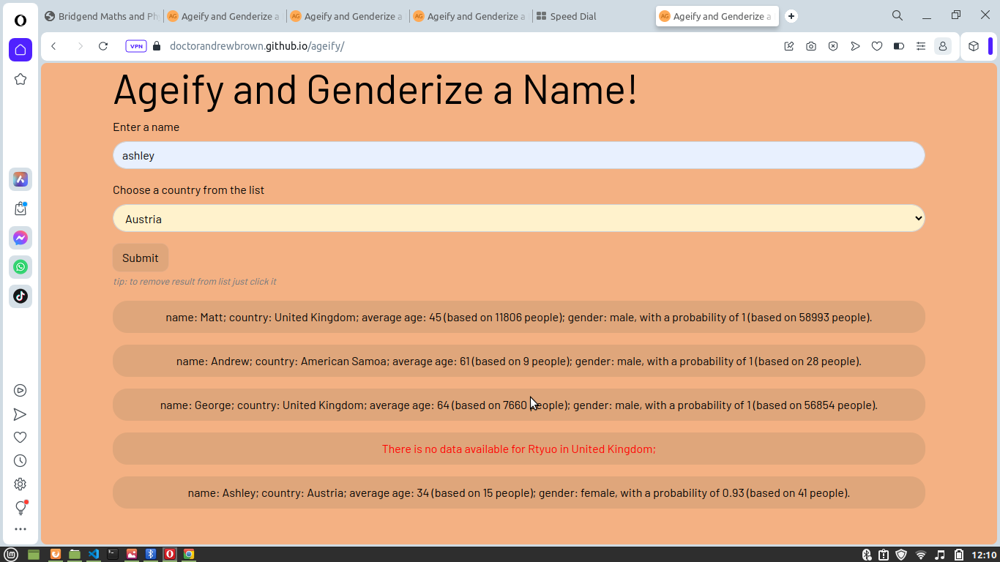

# Testing

Return back to the [README.md](README.md) file.

### HTML

I have used the recommended [HTML W3C Validator](https://validator.w3.org) to validate all of my HTML files.

| Page | W3C URL | Screenshot | |
| --- | --- | --- | --- |
| Home | [W3C](https://validator.w3.org/nu/?doc=https%3A%2F%2Fdoctorandrewbrown.github.io%2Fageify%2F) |  | 
|

### CSS

I have used the recommended [CSS Jigsaw Validator](https://jigsaw.w3.org/css-validator) to validate all of my CSS files.

| File | Jigsaw URL | Screenshot | |
| --- | --- | --- | --- |
| style.css | [Jigsaw](https://jigsaw.w3.org/css-validator/validator?uri=https%3A%2F%2Fdoctorandrewbrown.github.io%2Fageify%2F&profile=css3svg&usermedium=all&warning=1&vextwarning=&lang=en) ||
### JavaScript

I have used the recommended [JShint Validator](https://jshint.com) to validate all of my JS files.


| File | Screenshot | Notes |
| --- | --- | --- |
| scripts.js |  | Missing () from new object constructor and missing semicolons |
 |

## Browser Compatibility

I've tested my deployed project on multiple browsers to check for compatibility issues.

| Browser | Screenshot | Notes |
| --- | --- | --- |
| Chrome |  | Minor problem with correct rendering of some styles in laptop view when using github pages hosting in chrome browser|
| Firefox |  | Works as expected |
| Opera |  | Works as expected |
|
- When using the Chrome browser with the site hosted on github-pages there were some problems with the styling of the site. These problems were not observed with Firefox and Opera browsers. The problems were also not observed with localhost testing. To test the effect of hosting provider on these problems the app was tested with Netlify free hosting with the site deployed from the same github repository as the github-pages site. In the case of Netlify hosting, the app worked as expected in Chrome as well as other browsers. The screenshot shows the Netlify hosted site in the Chrome browser.
  
 

 - The Netlify hosted site can be see [here](https://ageify.netlify.app/)
  
## Responsiveness


I've tested my deployed project on multiple devices to check for responsiveness issues.

| Device | Screenshot | Notes |
| --- | --- | --- |
| Mobile (DevTools) |  | Works as expected |
| Tablet (DevTools) |  | Works as expected |
| Laptop |  | Problem with styling in Chrome. Works as expected in Opera and Firefox |
| Samsung Galaxy mobile phone (real device) |  | Works as expected |
| Samsung Galaxy mobile phone (real device) |  | Works as expected |
## Lighthouse Audit


I've tested my deployed project using the Lighthouse Audit tool to check for any major issues.

| Page | Size | Screenshot | Notes |
| --- | --- | --- | --- |
| Home | Mobile |  | Some minor warnings |
| Home | Desktop |  | Some minor warnings |
|

## Defensive Programming

Defensive programming was manually tested with the below user acceptance testing:

| Page | User Action | Expected Result | Pass/Fail | Screenshot |Comments|
| --- | --- | --- | --- | --- |---|
| Home Page | | | | |
| | Click submit without filling required "name" form field | Inform user field is required | Pass | |The required country field is protected by being hard-coded select dropdown|
| | Submit non existent name| Show meaningful message where both apis return no data| Pass || App logic ensures meaningful message displayed rather than null values returned from api |
| | Submit name and country for which one api returns data but the other does not | Show partial data that is returned, and meaningful message flaging where no data is returned| Pass ||Example shows Ageify api has returned no data but Genderize api has. No instances of Genderize returning data but Agify not returning were seen in manual testing but logic is included to handle this possibility|
| |Submit name without capitalization | Enforce capitalization of name in results display| Pass ||Example shows user inputs a lowercase name which is capitalized in results by app logic|
|
|
## User Story Testing

| User Story | Screenshot | Comments |
| --- | --- |----|
| As a new site user, I would like to enter a name and country, so that I can find the average age and probable gender for the name in that country. |  |the screenshot shows the result record for the input name "Matt" and country input "UK"|
| As a new site user, I would like to have results for multiple requests shown as a list, so that I can make comparisons e.g. same name in different countries. |  ||
| As a new site user, I would like to have the ability to remove unwanted results from display so that I can keep results uncluttered (for recording in a screen shot for example). The screenshots show the same results list before and after the result for a non-existent name is removed|  |||
| As a new user I would like to be able to find what proportion of people in the UK who are named Ashley are males?|  | the screenshot shows that approximately 1 in 10 people in the UK named Ashley are males|
| As a new user I would like to find the average age of people in USA who are named George? |  | the screenshot shows that in the USA, people named George have an average age of 72 |

## Bugs
- JS Uncaught  Type Error: `apiData.age_count = ageCount` can not set property value for undefined apiData object

    

    - To fix this, I _declared a new object, 
     ```js
         let apiData = new Object();
    ``` 
    allowing a property `age_count`
    to be set for `apiData` object.

- JS Uncaught  Type Error: `Cannot read properties of null`. This error was caused by javascript attempting to read a value from html input element too soon. 
 
    

    - To fix this, I included the following code to add an event listener for the DOM loaded event, 
     ```js
     document.addEventListener("DOMContentLoaded", ()=>{..})
     ```
  
- Preventing default `submit` event for html `<form>` element: This issue prevented getting form user input before the default behavior.  
   

    - To fix this, I included the following code to prevent default `<form>` submission behavior; 
    ```js
    form.addEventListener("submit", (event)=> {
    event.preventDefault()....
    ```
## Unfixed Bugs
There are no remaining bugs that I am aware of.